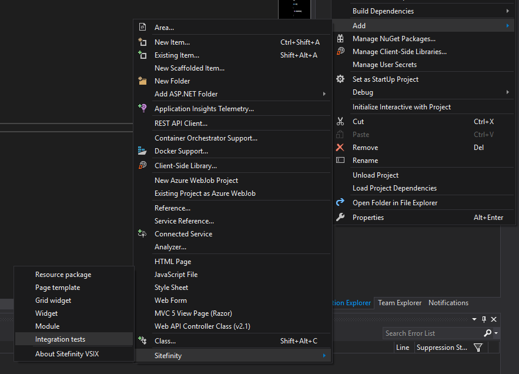

# Sitefinity VSIX
Sitefinity VSIX is a Visual Studio extension that allows you to create Sitefinity CMS related resources. This way you can easily scaffold Sitefinity CMS projects. The tool is focused on facilitating the development of MVC widgets and templates.

## Installation
Supported Visual Studio Versions: 2015, 2017, 2019 and 2022.

Note: For Visual Studio 2015 and 2017 (up to Update 15.3) you first need to install [.NET Core](https://www.microsoft.com/net/download/windows) before using the extension.

You can download the extension from Visual Studio Marketplace >> [Sitefinity VSIX](https://marketplace.visualstudio.com/items?itemName=vs-publisher-443.Sitefinity-VSIX). 
For Visual Studio 2022 there is a separate extension available from Visual Studio Marketplace >> [Sitefinity VSIX for VS 2022](https://marketplace.visualstudio.com/items?itemName=vs-publisher-443.Sitefinity-VSIX-VS22).

## Architecture
Sitefinity VSIX is based on Sitefinity CLI. After you install the extension, during the initial load of the first solution, the extension will download Sitefinity CLI from GitHub, extract it, and create a configuration file.

You can also download and use Sitefinity CLI independently, without installing Sitefinity VSIX.
For more information, see [Sitefinity CLI](https://github.com/Sitefinity/Sitefinity-CLI).

## Use Sitefinity VSIX

1. Open your Sitefinity CMS solution in Visual Studio.
2. In the context menu of SitefinityWebApp project, click *Add >> Sitefinity*.

   A submenu with available options expands.
3. Click the resource that you want to create.
4. A dialog appears, where you must fill out the information needed to create the resource. 

## Available commands
#### Resource package
Adds a new Resource package with some basic content in it. If the ResourcePackages folder is not existing it will be created.

Parameters:
 - *Name* - Enter the name of the resource package that you want to create.
 - *TemplateName* - Enter the name of the template you want to use for the creation. The default value is *Bootstrap*.

#### Page template
Adds a new Page template.

Parameters:
 - *Name* - Enter the name of the page template that you want to create.
 - *ResourcePackage* - Enter the name of the resource package where the template will be created. The default value is *Bootstrap*.
 - *TemplateName* - Enter the name of the template that you want to use in the creation. The default value is *Default*.

#### Grid widget

Adds a new Grid widget.

Parameters:
 - *Name* - Enter the name of the grid widget that you want to create.
 - *ResourcePackage* - Enter the name of the resource package where the widget will be created. The default value is *Bootstrap*.
 - *TemplateName* - Enter the name of the template you want to use for the creation. The default value is *grid-6+6*.

#### Widget
Adds a new custom widget.

Parameters:
 - *Name* - Enter the name of the widget that you want to create.
 - *TemplateName* - Enter the name of the template that you want to use in the creation. The default value is *Default*.
 
#### Module
Adds a new custom module. The generated structure demonstrates how a custom module can be implemented and integrated with Sitefinity CMS. 
Parameters:
 - *Name* - Enter the name of the custom module that you want to create. 
 - *Description* – Enter the description of the custom module that you want to create. 
 - *TemplateName* - Enter the name of the template that you want to use for creating your module. Different templates define different implementation structure for the sample module. The default value is *Default*.

#### Integration tests
Adds a new integration tests project, customized to work with Sitefinity CMS. Contains the integration test classes and instructions for implementation. 
Parameters:
 - *Name* - Enter the name of the integration tests project that you want to create. 
 - *TemplateName* - Enter the name of the template that you want to use for creating your integration tests project. Different templates define different implementation structure for the sample project. The default value is *Default*.
 
#### About
Provides information about the currently installed version of Sitefinity VSIX 

## Sitefinity version
Sitefinity VSIX will automatically try to detect the version of your Sitefinity CMS project and use the respective templates. If the version cannot be detected, Sitefinity VSIX uses the latest available version of the templates.

## Template generation and custom templates
For more information about templates generation and custom templates see the [Sitefinity CLI repository](https://github.com/Sitefinity/Sitefinity-CLI) 

## Known issues
#### Visual Studio 2015 integration
Sitefinity VSIX/CLI correctly updates the csproj and sln files but Visual Studio 2015 won't refresh the solution correctly. 
The workaround is to reopen the solution

#### Visual Studio freeze/crash bug
When Sitefinity VSIX is installed for the first time or there is a newer version of Sitefinity CLI, Visual Studio freezes until CLI is downloaded and unzipped and in some cases crashes. 

After Sitefinity CLI is downloaded and unzipped Visual Studio restores it's normal behaviour
